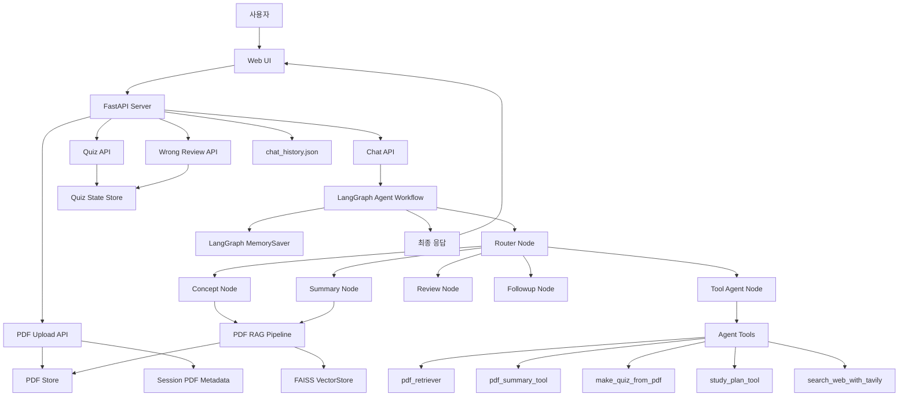
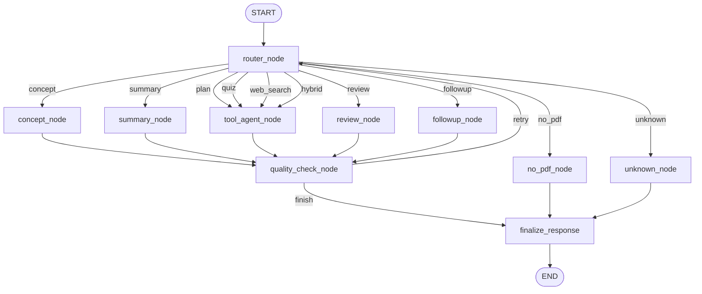
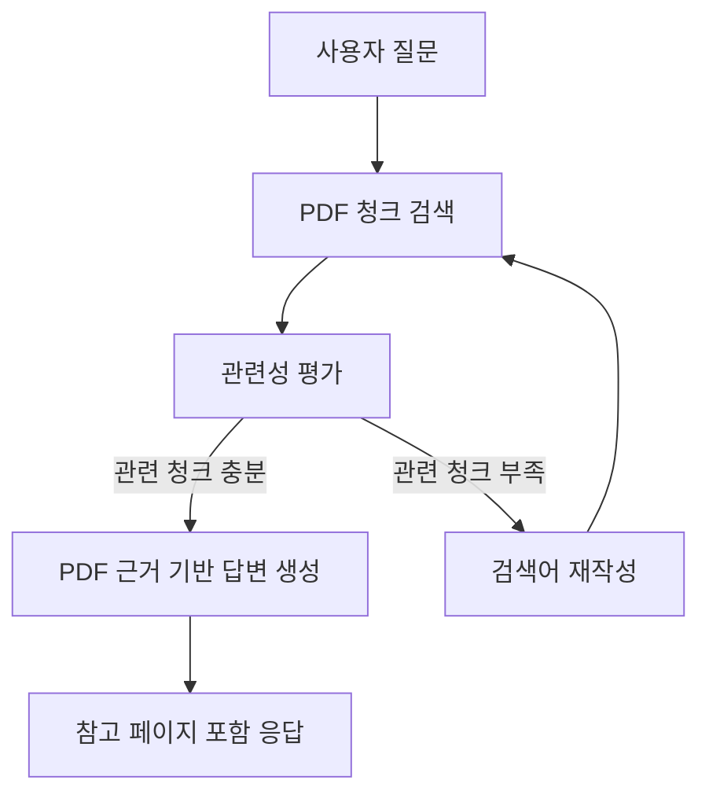

# StudyMate Agent

## 1. 서비스 소개

StudyMate Agent는 PDF 강의자료를 기반으로 시험공부를 도와주는 개인 학습 보조 Agent입니다.

시험공부를 할 때 GPT에게 PDF 기반 개념 설명이나 예상문제 생성을 요청하는 경우가 많지만, 대화가 길어지면 PDF 내용을 다시 업로드해야 하거나 이전에 틀린 문제를 찾기 위해 채팅 기록을 직접 뒤져야 하는 불편함이 있었습니다.  
이러한 문제를 해결하기 위해 PDF 기반 질의응답, 예상문제 생성, 오답 복습을 하나의 학습 세션 안에서 이어서 사용할 수 있는 StudyMate Agent를 제작하였습니다.

사용자는 PDF를 업로드한 뒤 자연어로 질문할 수 있으며, Agent는 업로드된 PDF를 검색하여 개념 설명, 요약, 공부 계획, 예상문제 생성, 답안 확인, 오답 복습 등을 수행합니다.

---

## 2. 주요 기능

| 기능                 | 설명                                                 |
| -------------------- | ---------------------------------------------------- |
| PDF 업로드           | 사용자가 강의자료 PDF를 업로드하면 세션 단위로 저장  |
| PDF 기반 질의응답    | 업로드된 PDF 내용을 검색하여 개념 질문에 답변        |
| PDF 요약             | 강의자료의 핵심 내용을 학습용으로 정리               |
| 공부 계획 생성       | PDF 내용을 바탕으로 시험 대비 공부 계획 생성         |
| 예상문제 생성        | PDF에서 시험에 나올 만한 내용을 바탕으로 문제 생성   |
| 답안 확인            | 사용자가 제출한 답안을 확인하고 해설 제공            |
| 오답 복습            | 틀린 문제를 따로 저장하고 다시 확인 가능             |
| PDF 근거 페이지 확인 | 답변에 사용된 PDF 페이지를 이미지로 확인             |
| 웹 검색 보조         | 필요한 경우 Tavily를 이용해 외부 자료 검색           |
| 대화 세션 저장       | 이전 대화와 연결된 PDF, 메시지 기록을 다시 확인 가능 |

---

## 3. 사용 시나리오

### 시나리오 1. PDF 기반 개념 학습

1. 사용자가 운영체제 강의자료 PDF를 업로드한다.
2. 사용자가 “프로세스와 스레드 차이 설명해줘”라고 질문한다.
3. Agent는 PDF에서 관련 내용을 검색한다.
4. 검색된 PDF 근거를 바탕으로 개념을 설명한다.
5. 사용자는 답변에 포함된 참고 페이지를 확인할 수 있다.

### 시나리오 2. 시험 대비 예상문제 풀이

1. 사용자가 “이 PDF에서 예상문제 만들어줘”라고 요청한다.
2. Agent는 PDF 내용을 기반으로 예상문제를 생성한다.
3. 사용자가 한 문제씩 답을 입력한다.
4. Agent는 정답 여부와 해설을 제공한다.
5. 틀린 문제는 오답 목록에 저장된다.

### 시나리오 3. 오답 복습

1. 사용자가 이전에 틀린 문제를 다시 확인하고 싶어 한다.
2. 오답 목록에서 틀린 문제를 선택한다.
3. 문제, 사용자의 답, 정답, 해설, PDF 근거를 다시 확인한다.
4. 채팅 기록을 직접 뒤지지 않아도 오답 복습이 가능하다.

---

## 4. 전체 아키텍처

StudyMate Agent는 FastAPI 기반 서버, LangGraph 기반 Agent Workflow, PDF RAG 검색, Tool Agent, Web UI로 구성됩니다.



---

## 5. Workflow 다이어그램

아래 다이어그램은 LangGraph 기반 Agent의 전체 실행 흐름을 나타냅니다.  
사용자 요청은 `router_node`에서 먼저 분류되고, 요청 유형에 따라 개념 설명, 요약, 퀴즈, 공부 계획, 오답 복습 등의 노드로 분기됩니다.



서버 실행 후 LangGraph Mermaid 다이어그램은 다음 주소에서도 확인할 수 있습니다.

```text
http://127.0.0.1:8000/api/graph/mermaid
```

---

## 6. RAG 처리 흐름

PDF 기반 질의응답과 요약은 RAG 검색 흐름을 통해 처리됩니다.



### RAG 동작 과정

1. 사용자가 PDF를 업로드한다.
2. `pypdf`를 이용해 PDF 페이지별 텍스트를 추출한다.
3. 추출된 텍스트를 청크 단위로 분할한다.
4. OpenAI Embedding을 이용해 FAISS VectorStore를 생성한다.
5. 사용자의 질문과 관련 있는 PDF 청크를 검색한다.
6. 검색 결과의 관련성을 평가한다.
7. 관련 청크가 부족하면 검색어를 재작성하여 다시 검색한다.
8. 최종적으로 PDF 근거를 바탕으로 학습 답변을 생성한다.

OpenAI API Key가 없거나 VectorStore 생성에 실패하는 경우에는 키워드 기반 fallback 검색을 사용합니다.

---

## 7. 사용된 Tool 설명

StudyMate Agent는 요청 유형에 따라 필요한 Tool을 선택하여 실행합니다.

| Tool                     | 역할                                               |
| ------------------------ | -------------------------------------------------- |
| `pdf_retriever`          | 업로드된 PDF에서 질문과 관련 있는 문단 검색        |
| `pdf_summary_tool`       | PDF 전체 요약에 필요한 핵심 문단 검색              |
| `make_quiz_from_pdf`     | PDF 내용을 기반으로 예상문제 생성을 위한 근거 검색 |
| `study_plan_tool`        | PDF 내용을 바탕으로 공부 계획 생성                 |
| `search_web_with_tavily` | PDF 외부의 최신 정보나 보충 자료 검색              |

Tool Agent는 사용자의 요청이 공부 계획, 예상문제, 웹 검색, Hybrid 검색처럼 도구 사용이 필요한 경우 실행됩니다.

---

## 8. Memory 설명

본 프로젝트에서는 학습 흐름을 유지하기 위해 여러 종류의 메모리를 사용합니다.

| Memory                  | 설명                                       |
| ----------------------- | ------------------------------------------ |
| `LangGraph MemorySaver` | Agent 실행 중 대화 상태와 흐름을 유지      |
| `localStorage`          | Web UI에서 현재 세션 ID 저장               |
| `chat_history.json`     | 세션별 대화 기록 저장                      |
| `session_pdfs.json`     | 세션 ID와 업로드된 PDF 파일 연결 정보 저장 |
| `QUIZ_STATES`           | 현재 진행 중인 퀴즈 상태 저장              |
| 오답 목록               | 사용자가 틀린 문제를 세션별로 저장         |

이를 통해 사용자는 매번 PDF를 다시 업로드하지 않고, 같은 세션에서 이전 대화와 PDF 기반 학습 흐름을 이어갈 수 있습니다.

---

## 9. Middleware 설명

서버에는 Request Logging Middleware가 적용되어 있습니다.

### 주요 역할

- 요청 시작 및 종료 로그 기록
- HTTP method, path, status code 기록
- 요청 처리 시간 계산
- 응답 헤더에 `X-Process-Time-ms` 추가
- 서버 오류 발생 시 JSON 형태의 오류 응답 반환

Middleware를 통해 API 요청 흐름을 확인할 수 있고, 디버깅 및 오류 추적이 쉬워집니다.

---

## 10. API 구성

| Method | URL                           | 설명                                       |
| ------ | ----------------------------- | ------------------------------------------ |
| GET    | `/api/health`                 | 서버 상태 확인                             |
| GET    | `/api/graph/mermaid`          | LangGraph Workflow Mermaid 다이어그램 조회 |
| POST   | `/api/pdf/upload`             | PDF 업로드                                 |
| GET    | `/api/pdf/status`             | 현재 세션의 PDF 상태 확인                  |
| GET    | `/api/pdf/page-image`         | PDF 특정 페이지 이미지 조회                |
| POST   | `/api/chat`                   | Agent에게 학습 질문 전송                   |
| GET    | `/api/chat/sessions`          | 대화 세션 목록 조회                        |
| POST   | `/api/chat/sessions`          | 새 대화 세션 생성                          |
| GET    | `/api/chat/messages`          | 특정 세션의 메시지 조회                    |
| POST   | `/api/quiz/start`             | 예상문제 풀이 시작                         |
| POST   | `/api/quiz/answer`            | 퀴즈 답안 제출                             |
| GET    | `/api/quiz/wrongs`            | 오답 목록 조회                             |
| GET    | `/api/quiz/wrongs/{wrong_id}` | 오답 상세 조회                             |

---

## 11. 프로젝트 구조

```text
studymate_ready/
├── agent/
│   ├── chains.py
│   ├── graph.py
│   ├── prompts.py
│   ├── schemas.py
│   └── tools.py
│
├── services/
│   ├── chat_history.py
│   ├── chat_store.py
│   ├── pdf_store.py
│   ├── quiz_store.py
│   └── session_store.py
│
├── static/
│   ├── index.html
│   ├── app.js
│   └── style.css
│
├── data/
│   ├── pdfs/
│   ├── chat_history.json
│   └── session_pdfs.json
│
├── server.py
├── requirements.txt
├── .env.example
└── README.md
```

### 폴더별 역할

| 폴더/파일          | 설명                                            |
| ------------------ | ----------------------------------------------- |
| `agent/`           | LangGraph Agent, Tool, Prompt, Schema 관련 코드 |
| `services/`        | PDF 저장, 세션 저장, 채팅 기록, 퀴즈 상태 관리  |
| `static/`          | Web UI HTML, CSS, JavaScript                    |
| `data/`            | 업로드된 PDF, 대화 기록, 세션 PDF 정보 저장     |
| `server.py`        | FastAPI 서버 실행 파일                          |
| `requirements.txt` | 실행에 필요한 패키지 목록                       |
| `.env.example`     | 환경변수 예시 파일                              |

---

## 12. 설치 및 실행 방법

### 1. 프로젝트 클론

```bash
git clone https://github.com/syprisilla/Studymate_Agent.git
cd Studymate_Agent
```

### 2. 가상환경 생성

```bash
python -m venv venv
```

### 3. 가상환경 실행

Windows PowerShell 기준:

```bash
venv\Scripts\activate
```

macOS 또는 Linux 기준:

```bash
source venv/bin/activate
```

### 4. 패키지 설치

```bash
pip install -r requirements.txt
```

### 5. 환경변수 설정

`.env.example` 파일을 복사하여 `.env` 파일을 생성합니다.

Windows PowerShell 기준:

```bash
copy .env.example .env
```

macOS 또는 Linux 기준:

```bash
cp .env.example .env
```

`.env` 파일 예시는 다음과 같습니다.

```env
OPENAI_API_KEY=your_openai_api_key_here
MODEL_NAME=gpt-4o-mini
TAVILY_API_KEY=your_tavily_api_key_here
```

### 6. 서버 실행

```bash
uvicorn server:app --reload --host 127.0.0.1 --port 8000
```

또는 다음 명령어로 실행할 수 있습니다.

```bash
python server.py
```

### 7. 브라우저 접속

```text
http://127.0.0.1:8000
```

---

## 13. 실행 가능한 제출 형태

본 프로젝트는 실행 가능한 형태로 제출하기 위해 다음 파일을 포함합니다.

| 파일               | 설명                                            |
| ------------------ | ----------------------------------------------- |
| `server.py`        | FastAPI 서버 실행 파일                          |
| `requirements.txt` | 필요한 Python 패키지 목록                       |
| `.env.example`     | API Key 설정 예시                               |
| `README.md`        | 서비스 설명, 실행 방법, 아키텍처, Workflow 설명 |
| `static/`          | 프론트엔드 파일                                 |
| `agent/`           | LangGraph Agent 관련 코드                       |
| `services/`        | PDF, 세션, 퀴즈, 채팅 기록 관리 코드            |

실행 시 `requirements.txt`를 통해 필요한 패키지를 설치할 수 있으며, `.env` 파일에 API Key를 설정한 뒤 서버를 실행하면 웹 브라우저에서 서비스를 사용할 수 있습니다.

---

## 14. 사용 예시

```text
이 PDF 핵심 내용 요약해줘
프로세스와 스레드 차이 설명해줘
시험에 나올 만한 예상문제 만들어줘
운영체제 시험 대비 공부 계획 세워줘
방금 문제 정답은 B야
내가 틀린 문제 다시 보여줘
이 개념을 웹 자료랑 같이 설명해줘
```

---

## 15. 한계점

현재 구현에는 다음과 같은 한계가 있습니다.

| 한계                       | 설명                                                                                    |
| -------------------------- | --------------------------------------------------------------------------------------- |
| 스캔본 PDF 처리 한계       | `pypdf` 기반 텍스트 추출을 사용하므로 이미지 중심 PDF는 OCR 없이는 처리하기 어렵습니다. |
| VectorStore 영구 저장 한계 | FAISS 인덱스가 완전한 DB 형태로 영구 관리되지는 않습니다.                               |
| 퀴즈 상태 초기화 가능성    | 일부 퀴즈 진행 상태는 서버 메모리에 저장되어 서버 재시작 시 초기화될 수 있습니다.       |
| API Key 의존성             | OpenAI API Key가 없으면 LLM 응답, 임베딩 검색, 퀴즈 생성 품질이 제한됩니다.             |
| 웹 검색 제한               | Tavily API Key가 없으면 외부 웹 검색 기능을 사용할 수 없습니다.                         |
| 다중 사용자 관리 한계      | 로그인 기반 사용자 분리 기능은 아직 구현되어 있지 않습니다.                             |

---

## 16. 향후 개선 방향

향후 다음 기능을 추가하여 학습 보조 Agent의 완성도를 높일 수 있습니다.

- OCR 기능 추가를 통한 스캔본 PDF 처리
- FAISS 인덱스 및 퀴즈 상태의 DB 저장
- 사용자 로그인 및 사용자별 학습 기록 관리
- 여러 PDF를 하나의 세션에서 함께 학습하는 기능
- 문제 유형 선택 기능 추가
- 난이도별 예상문제 생성 기능 추가
- 오답률 기반 취약 개념 분석 기능 추가
- 시험 범위별 자동 요약 기능 추가
- PDF 페이지 이미지와 해설을 더 직접적으로 연결하는 복습 화면 개선
