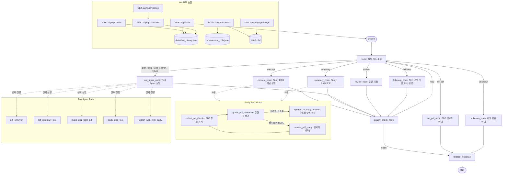

# StudyMate Agent

PDF 강의자료를 업로드하면 해당 문서를 기반으로 개념 설명, 요약, 공부 계획, 예상문제, 답안 채점, 오답 복습을 도와주는 FastAPI + LangGraph 기반 학습 Agent입니다.

사용자는 웹 채팅창에 자연어로 질문하고, Agent는 요청 의도를 `concept`, `summary`, `plan`, `quiz`, `review`, `followup`, `web_search`, `hybrid` 등으로 분류한 뒤 필요한 RAG 검색 또는 Tool을 실행합니다. Web UI에서는 PDF 업로드, 대화 기록, 사용 Tool, 참고 페이지, 실행 Trace, 오답 목록을 함께 확인할 수 있습니다.

## 기획 의도

시험공부를 할 때 GPT에게 PDF 기반 개념 설명이나 예상문제 생성을 요청하는 경우가 많지만, 대화가 길어지면 PDF 내용을 다시 업로드해야 하거나 이전에 틀린 문제를 찾기 위해 채팅 기록을 직접 뒤져야 하는 불편함이 있었습니다. 이러한 문제를 해결하고자 StudyMate Agent를 제작하게 되었습니다.

## 주요 기능

- FastAPI 기반 Web Chat UI
- LangGraph `StateGraph` 기반 Agent 실행 흐름
- LLM + `PydanticOutputParser` 기반 자연어 요청 라우팅
- PDF 업로드 및 세션별 PDF 상태 유지
- `pypdf` 기반 PDF 텍스트 추출
- OpenAI Embedding + FAISS 기반 PDF RAG 검색
- OpenAI API 미설정 시 키워드 기반 fallback 검색
- PDF 문단 관련성 평가 및 검색어 재작성 재시도
- 개념 설명/요약용 Study RAG Graph 분리
- Tool Agent 기반 공부 계획, 퀴즈, 웹 검색, Hybrid 요청 처리
- Tavily 기반 최신 정보 및 외부 자료 검색
- PDF 근거 페이지 표시 및 페이지 이미지 모달 확인
- 예상문제 생성, 답안 제출, 정오답 판정
- 오답 목록 저장 및 오답 상세 복습
- 대화 세션 목록/메시지 JSON 저장
- Request Logging Middleware 및 전역 예외 처리

## 사용 예시

```text
현재 PDF 요약해줘
이 PDF에서 중요한 개념이 뭐야?
프로세스와 스레드 차이를 쉽게 설명해줘
시험 대비 공부 계획 3일치 만들어줘
예상문제 5개 만들어줘
A가 정답이야
방금 설명한 내용 더 자세히 알려줘
이 개념의 최신 사례도 찾아줘
PDF 내용이랑 웹 자료를 같이 참고해서 설명해줘
내 답이 맞는지 채점해줘
```

## LangGraph workflow



```text
http://127.0.0.1:8000/api/graph/mermaid
```

## 설치

### 1. 가상환경 생성

```bash
python -m venv venv
```

Windows PowerShell:

```bash
venv\Scripts\activate
```

### 2. 패키지 설치

```bash
pip install -r requirements.txt
```

주요 패키지는 다음 계열을 사용합니다.

- `fastapi`
- `uvicorn`
- `langchain`
- `langchain-openai`
- `langchain-community`
- `langgraph`
- `faiss-cpu`
- `pypdf`
- `pymupdf`
- `tavily-python`

### 3. 환경변수 설정

`.env.example`을 복사해 `.env`를 만듭니다.

```bash
copy .env.example .env
```

`.env` 예시:

```env
OPENAI_API_KEY=your_openai_api_key_here
MODEL_NAME=gpt-4o-mini
TAVILY_API_KEY=tvly-your_api_key_here
```

`OPENAI_API_KEY`가 없으면 PDF 텍스트 일부를 기반으로 한 fallback 응답은 가능하지만, LLM 라우팅, 구조화 답변, FAISS 임베딩 검색, 퀴즈 생성 품질은 제한됩니다.

`TAVILY_API_KEY`는 최신 정보, 외부 사례, 웹 검색 요청을 처리하는 `search_web_with_tavily` Tool에서 사용합니다.

### 4. 서버 실행

```bash
uvicorn server:app --reload --host 127.0.0.1 --port 8000
```

또는 다음 명령으로도 실행할 수 있습니다.

```bash
python server.py
```

브라우저 접속:

```text
http://127.0.0.1:8000
```

## Web UI

### PDF 업로드

오른쪽 패널에서 PDF 파일을 업로드합니다. 업로드된 파일은 `data/pdfs/`에 저장되고, 세션별 PDF 연결 정보는 `data/session_pdfs.json`에 기록됩니다.

PDF에서 텍스트를 추출하지 못하면 업로드가 실패합니다. 스캔본 PDF는 별도 OCR 처리가 필요합니다.

### Chat

채팅창에 자연어로 학습 요청을 입력합니다. Agent는 요청을 분류한 뒤 PDF RAG 검색, Tool Agent 실행, 답안 채점, 후속 질문 처리 중 적절한 흐름을 선택합니다.

답변에는 가능한 경우 참고한 PDF 페이지가 포함됩니다. 페이지 근거를 클릭하면 해당 PDF 페이지 이미지가 모달로 표시됩니다.

### Agent 판단 패널

오른쪽 패널에서 최근 응답의 내부 실행 정보를 확인할 수 있습니다.

- Route
- 사용 Tool
- RAG 근거
- Agent Trace

### Quiz / 오답 복습

사용자가 “예상문제 5개 만들어줘”처럼 요청하면 `/api/quiz/start`가 호출되어 PDF 근거 기반 문제가 생성됩니다.

퀴즈 진행 중에는 사용자의 답안을 `/api/quiz/answer`로 제출하며, 오답은 세션별 메모리에 저장됩니다. 오답 목록에서 항목을 클릭하면 문제, 내 답, 정답, 해설, PDF 근거를 다시 확인할 수 있습니다.

## API

### Health

```http
GET /api/health
```

서비스 상태, 모델명, 사용 가능한 Tool, route 목록을 반환합니다.

### Mermaid Graph

```http
GET /api/graph/mermaid
```

LangGraph 실행 흐름을 Mermaid 텍스트로 반환합니다.

### PDF 업로드

```http
POST /api/pdf/upload
```

`multipart/form-data` 요청:

```text
file: 업로드할 PDF
session_id: 현재 대화 세션 ID
```

응답:

```json
{
  "ok": true,
  "pdf_name": "lecture.pdf",
  "session_id": "browser-session-id",
  "text_length": 12000,
  "has_vectorstore": true
}
```

### PDF 상태

```http
GET /api/pdf/status?session_id=browser-session-id
```

현재 세션에 연결된 PDF, 텍스트 길이, VectorStore 사용 여부를 반환합니다.

### PDF 페이지 이미지

```http
GET /api/pdf/page-image?session_id=browser-session-id&page=1&pdf_name=lecture.pdf
```

PyMuPDF로 특정 PDF 페이지를 PNG 이미지로 렌더링해 반환합니다.

### Chat

```http
POST /api/chat
```

요청:

```json
{
  "message": "이 PDF의 핵심 개념을 정리해줘",
  "session_id": "browser-session-id"
}
```

응답에는 `answer`, `route`, `session_id`, `pdf_name`, `used_tools`, `evidence`, `trace`가 포함됩니다.

### 대화 세션

```http
GET /api/chat/sessions
POST /api/chat/sessions
GET /api/chat/messages?session_id=browser-session-id
```

대화 목록을 조회하거나 새 대화를 만들고, 특정 세션의 메시지를 불러옵니다.

호환용 API도 함께 제공됩니다.

```http
GET /api/chats
POST /api/chats
GET /api/chats/{session_id}
DELETE /api/chats/{session_id}
```

### Quiz 시작

```http
POST /api/quiz/start
```

요청:

```json
{
  "session_id": "browser-session-id",
  "topic": "운영체제 예상문제 5개",
  "count": 5
}
```

PDF 근거를 검색한 뒤 예상문제를 생성하고 첫 번째 문제를 반환합니다.

### Quiz 답안 제출

```http
POST /api/quiz/answer
```

요청:

```json
{
  "session_id": "browser-session-id",
  "answer": "A"
}
```

정답 여부, 해설, 다음 문제, 오답 목록을 반환합니다.

### 오답 조회

```http
GET /api/quiz/wrongs?session_id=browser-session-id
GET /api/quiz/wrongs/{wrong_id}?session_id=browser-session-id
```

세션별 오답 목록과 오답 상세 해설을 조회합니다.

## LangGraph Agent

Agent 상태는 `agent/graph.py`의 `State`로 관리합니다.

주요 상태:

- `messages`
- `session_id`
- `route`
- `final_response`
- `trace`
- `used_tools`
- `evidence`
- `retry_count`
- `quality_next`

노드:

- `router`: LLM 또는 키워드 fallback으로 요청 route 결정
- `concept_node`: PDF 기반 개념 설명용 Study RAG 실행
- `summary_node`: PDF 전체 요약용 Study RAG 실행
- `tool_agent_node`: Tool Agent가 필요한 도구를 선택해 실행
- `review_node`: 사용자 답안을 PDF 근거와 비교해 채점
- `followup_node`: 직전 AI 답변을 바탕으로 후속 요청 처리
- `quality_check_node`: 실패성 응답 감지 시 최대 1회 재시도
- `no_pdf_node`: PDF가 없을 때 업로드 안내
- `unknown_node`: 지원 범위 안내
- `finalize_response`: 최종 AIMessage 생성

조건부 분기:

- PDF가 필요한 route인데 세션에 PDF가 없으면 `no_pdf`로 전환
- `concept`, `summary`는 Study RAG Graph로 처리
- `plan`, `quiz`, `web_search`, `hybrid`는 Tool Agent로 처리
- 응답이 비어 있거나 오류성 문구를 포함하면 `quality_check_node`에서 재시도

Memory:

- LangGraph `MemorySaver` checkpointer 사용
- Web UI는 `localStorage`에 현재 `session_id` 저장
- 서버는 `data/chat_history.json`에 세션별 메시지 저장

## Tools

### `pdf_retriever`

업로드된 PDF에서 질문과 관련 있는 청크를 검색합니다. 응답에는 참고 페이지와 검색 문맥이 포함됩니다.

### `pdf_summary_tool`

PDF 전체 요약에 필요한 핵심 문단을 검색합니다.

### `make_quiz_from_pdf`

PDF 내용을 바탕으로 예상문제를 만들기 위한 근거를 검색합니다. 실제 구조화 퀴즈 생성은 `/api/quiz/start`에서도 별도로 수행됩니다.

### `study_plan_tool`

업로드된 PDF 내용을 기준으로 며칠 단위의 공부 계획을 세우기 위한 핵심 문단을 검색합니다.

### `search_web_with_tavily`

최신 정보, 외부 사례, PDF 밖의 보충 설명이 필요할 때 Tavily Search API를 사용합니다.

## RAG 구성

PDF 검색 파이프라인은 `services/pdf_store.py`, `agent/chains.py`, `agent/tools.py`에 걸쳐 구성됩니다.

1. 사용자가 PDF를 업로드
2. `pypdf`로 페이지별 텍스트 추출
3. 페이지 문서를 900자 단위 청크로 분할
4. OpenAI Embedding이 가능하면 FAISS VectorStore 생성
5. 질문 시 FAISS retriever로 관련 청크 검색
6. VectorStore가 없거나 실패하면 키워드 기반 fallback 검색
7. LLM으로 관련성 평가
8. 관련 청크가 부족하면 검색어 재작성 후 재검색
9. PDF 근거를 바탕으로 구조화 학습 답변 생성

PDF 저장 경로:

```text
data/
├── pdfs/
├── session_pdfs.json
└── chat_history.json
```

## 저장소

### `data/chat_history.json`

대화 세션 목록과 메시지를 저장합니다.

저장 항목:

- `session_id`
- `title`
- `pdf_name`
- `created_at`
- `updated_at`
- `messages`

각 메시지에는 role, content, route, 사용 Tool, 근거 페이지가 함께 저장될 수 있습니다.

### `data/session_pdfs.json`

세션 ID와 업로드된 PDF 파일명을 연결합니다. 서버 재시작 후 같은 세션을 열면 가능한 경우 PDF 텍스트와 검색 인덱스를 복원합니다.

### 메모리 상태

다음 항목은 서버 프로세스 메모리에 유지됩니다.

- `services.session_store.SESSIONS`
- `services.quiz_store.QUIZ_STATES`
- LangGraph `MemorySaver`

따라서 프로세스 재시작 시 진행 중인 퀴즈 상태와 일부 메모리 대화 흐름은 초기화될 수 있습니다.

## Middleware

`server.py`에는 Request Logging Middleware가 적용되어 있습니다.

기능:

- 요청 시작/종료 로그 기록
- HTTP method/path/status 로깅
- 처리 시간 계산
- 응답 헤더 `X-Process-Time-ms` 추가
- 예외 발생 시 전역 예외 핸들러로 JSON 오류 반환

## 프로젝트 구조

```text
studymate_ready/
├── agent/
│   ├── chains.py
│   ├── graph.py
│   ├── prompts.py
│   ├── schemas.py
│   └── tools.py
├── services/
│   ├── chat_history.py
│   ├── chat_store.py
│   ├── pdf_store.py
│   ├── quiz_store.py
│   └── session_store.py
├── static/
│   ├── index.html
│   ├── app.js
│   └── style.css
├── data/
│   ├── pdfs/
│   ├── chat_history.json
│   └── session_pdfs.json
├── server.py
├── requirements.txt
├── .env.example
└── README.md
```

## 한계 및 개선 방향

### 한계

- PDF 텍스트 추출은 `pypdf` 기반이므로 스캔본이나 이미지 중심 PDF는 OCR 없이는 처리하기 어렵습니다.
- FAISS 인덱스는 세션 메모리에 생성되며, 영구 Vector DB로 저장하지 않습니다.
- 퀴즈 진행 상태와 오답 상태는 서버 메모리에 저장되어 프로세스 재시작 시 사라집니다.
- `OPENAI_API_KEY`가 없으면 구조화 답변, 임베딩 검색, 퀴즈 생성 품질이 제한됩니다.
- Tavily 패키지 또는 `TAVILY_API_KEY`가 없으면 웹 검색 Tool은 사용할 수 없습니다.

### 개선 방향

- 스캔본 PDF를 위한 OCR 파이프라인을 추가하면 더 다양한 강의자료를 처리할 수 있습니다.
- FAISS 인덱스와 퀴즈 상태를 디스크 또는 DB에 저장하면 서버 재시작 후에도 학습 흐름을 이어갈 수 있습니다.
- 사용자 로그인과 DB 기반 세션 저장을 도입하면 여러 사용자의 학습 기록을 안정적으로 분리할 수 있습니다.
- 퀴즈 유형, 난이도, 범위를 UI에서 직접 조절할 수 있도록 확장할 수 있습니다.
- PDF 여러 개를 한 세션에 연결하고 문서별 출처를 비교하는 Hybrid RAG 기능을 추가할 수 있습니다.
